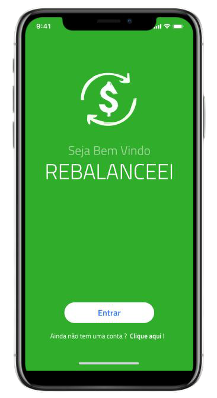

   

# Rebalanceei - Back-End

#### :postbox: About

- API created in GraphQL to provide data for a financial portfolio rebalancing app.
- :construction_worker: Under construction ...

#### :pushpin: Prototype

- [Figma](https://www.figma.com/proto/qfuBhnUegnf4mvHtFPEUsO/Untitled?node-id=25%3A885&scaling=scale-down)

#### :rocket: User Stack Status

- GraphQL Apollo Server : Testing ...
- Jest: Testing ...
- React Native : Waiting to finish the Back-End ....
